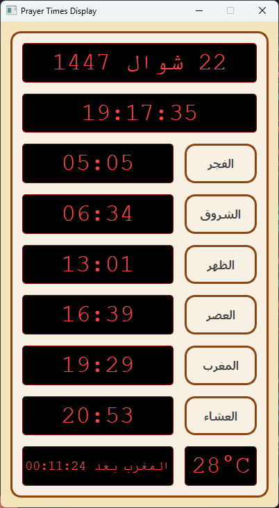

# 🕌 Prayer Times Display

[](https://www.python.org/)
[](https://www.riverbankcomputing.com/software/pyqt/)
[](https://opensource.org/licenses/MIT)

A premium, feature-rich desktop application built with Python and PyQt5 to help you keep track of prayer times, dates, and local weather with a beautiful digital interface.



## ✨ Features

- 🕋 **Accurate Prayer Times**: Fetches real-time data from the [Aladhan API](https://aladhan.com/prayer-times-api).
- 📅 **Dual Calendar**: Automatically toggles between **Hijri** and **Gregorian** dates with Arabic month names.
- 🌡️ **Weather Integration**: Displays current local temperature using the [OpenWeatherMap API](https://openweathermap.org/api).
- 🕒 **Digital Clock**: Sleek "Digital-7" style display for time and prayer countdowns.
- 🔔 **Athan Alarms**: Visual and audio notifications (Athan) when it's time to pray.
- 📥 **System Tray Support**: Runs quietly in the background with a quick-access menu to view today's times.
- 💾 **Offline Cache**: Saves current data locally to ensure functionality even without an internet connection.

## 🚀 Installation

### Prerequisites
- Python 3.8 or higher
- Pip (Python package installer)

### Setup
1. **Clone the repository**:
   ```bash
   git clone https://github.com/AhmedAzzi/prayer_times_Qt.git
   cd prayer_times_Qt
   ```

2. **Install dependencies**:
   ```bash
   pip install -r requirements.txt
   ```

3. **Run the application**:
   ```bash
   python src/main.py
   ```

## 🛠️ Built With

- **[PyQt5](https://www.riverbankcomputing.com/software/pyqt/)** - The GUI framework.
- **[Requests](https://requests.readthedocs.io/)** - For API communication.
- **[HijriDate](https://pypi.org/project/hijridate/)** - For accurate Hijri date conversion.

## 📸 Screenshots

| Main Interface | System Tray |
| :---: | :---: |
|  | *Quietly monitoring in the tray* |

## 📄 License

This project is licensed under the MIT License - see the [LICENSE](LICENSE) file for details.

---
*Created with ❤️ by [Ahmed Azzi](https://github.com/AhmedAzzi)*